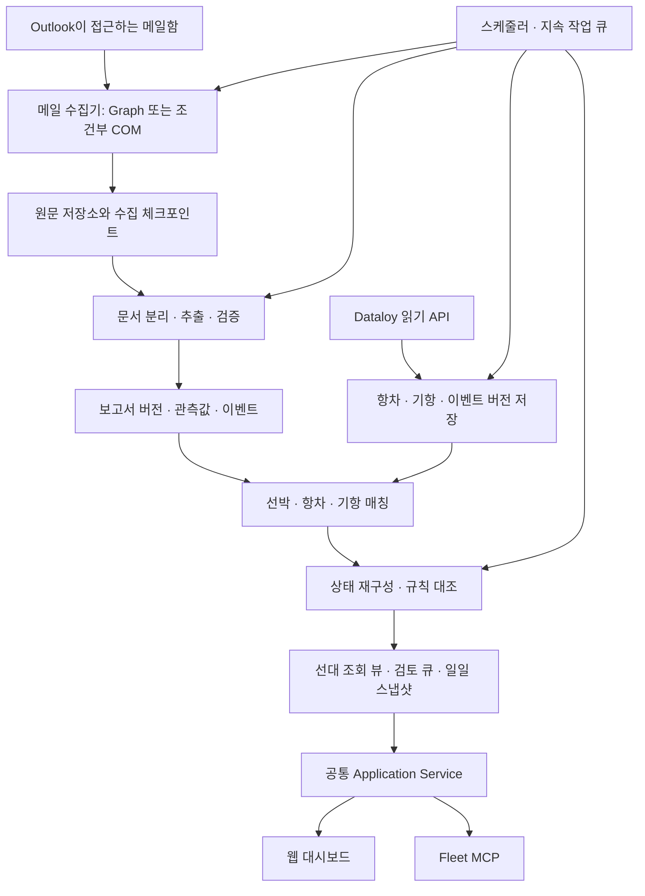

# Fleet Operations Dashboard — 재설계 v2

작성: 2026-09-14. 상태: 구현용 제안 설계, 환경 검증 전.
기준: VMwareconnect 커밋 `49f760dde3326067fe2cde5ca8f6c5f7ccf868c2`의 README 및 docs/00~09.
상세 검토: [REVIEW-CLAUDE-DESIGN.ko.md](REVIEW-CLAUDE-DESIGN.ko.md).

## 1. 제품 정의

**Dataloy Operational 항차를 기준으로 선대를 구성하고, VMware에서 접근하는 Outlook의 본선 보고를 지속적으로 수집하여 선박별 최신 보고 위치·업무 상태·일정·Dataloy 반영 여부를 근거와 함께 보여주는 운항 검토 시스템**으로 설계한다.

사용자는 매일 다음 네 가지를 확인한다.

1. 오늘 관리해야 할 선박과 항차는 무엇인가?
2. 마지막으로 확인된 위치와 상태는 무엇이며, 언제의 정보인가?
3. 본선의 ETA·항만 이벤트·작업 진행이 Dataloy에 어떻게 반영되어 있는가?
4. 내가 확인하거나 수정해야 할 항목과 근거는 무엇인가?

MCP는 이 데이터에 자연어로 접근하는 인터페이스다. 매일 수집·판정·대시보드 갱신은 대화가 없어도 실행되어야 한다. v1은 Dataloy 읽기와 내부 검토 기록까지 포함한다. 외부 시스템 수정, 메일 발송, AIS, laytime 정산은 별도 범위다.

### 사실과 미확인 전제

확인한 것은 GitHub 설계와 공개 제품 문서다. 실제 VMware 종류, Outlook 종류, Exchange Online/on-premises 여부, VM의 지속성, 네트워크 경로, 메일 권한, Dataloy 스키마, 선대 규모는 아직 확인하지 않았다. 아래 기술 선택·주기·허용오차·성능 수치는 **초기 제안값**이며 실측 후 확정한다.

‘VMware 내부 Outlook’은 접근 환경을 뜻한다. 메일 원본이 반드시 VM 안에만 존재한다는 의미로 단정하지 않는다. Graph 이용 가능성이 있더라도 해당 메일함의 승인된 접근 경로여야 한다.

## 2. 목표 구조



처음부터 다수의 마이크로서비스로 나누지 않는다. **모듈형 Python 백엔드 + worker + 웹 UI + 필요한 경우 VM 수집 프로세스**를 기본으로 한다. 인증 정보와 접근 경계는 프로세스·계정별로 제한한다. MCP 서버 개수와 업무 모듈 개수는 동일할 필요가 없다.

### 배포 프로파일

| 조건 | 배포 |
|---|---|
| 사내 서버가 승인된 Graph와 Dataloy 모두 접근 가능 | 사내 서버에서 수집·파싱·대조·UI 실행. 가장 단순한 권장 경로. |
| Outlook COM만 사용 가능하고 VM에서 Dataloy도 접근 가능 | VM 사용자 세션 수집기 + 승인된 사내 backend. 단일 사용자 PoC는 VM 로컬 실행도 가능. |
| 메일망과 Dataloy 접근망이 분리 | VM 수집·원문·필요한 파싱 → 승인된 정규화 데이터 전달 → 분석 backend. 두 영역의 원문 접근 권한을 분리. |
| API·COM 모두 불가능 | 승인된 EML/MSG/파일 내보내기로 파서·대조 기능 검증. 지속 자동 수집 요구는 미충족으로 명시. |

Graph 경로는 Exchange 배치, 앱 권한 및 네트워크 검증 후 선택한다. COM은 Classic Outlook 설치·프로필·사용자 세션·보안 프롬프트·캐시 범위·VDI 재접속을 검증해야 한다. 로그오프 또는 비영구 VM 초기화 시 수집이 중단될 수 있으므로 이를 가용성 지표로 노출한다. COM을 비대화형 Windows Service로 배포하지 않는다. [Microsoft Outlook API](https://learn.microsoft.com/en-us/office/client-developer/outlook/selecting-an-api-or-technology-for-developing-solutions-for-outlook)

## 3. 데이터의 의미와 우선순위

값마다 `source`, `semantic_kind`, `valid_time`, `observed_at`, `evidence`, `quality`를 보존한다. 여러 소스를 하나의 ‘정답’ 컬럼에 덮어쓰지 않는다.

| 정보 | 기본 사용 방식 |
|---|---|
| 관리 대상 선박·항차·기항 계획 | Dataloy의 검증된 항차/선박 마스터 기준 |
| 본선 보고 위치 | 검증된 보고 관측시각 기준 최신 위치. ‘최신 보고 위치’라고 표기 |
| 항만·하역 진행 | 승인된 이벤트들의 시간순 재구성. 출처 간 충돌은 함께 표시 |
| ETA | 같은 기항에 대한 Dataloy 예측과 본선 신고 ETA를 병렬 표시 |
| 등록 실적 | Dataloy 이벤트 의미 및 확정 여부를 검증한 필드만 사용 |
| Dataloy에 저장된 본선 보고 | 추가 소스로 수집. 이메일과 출처 계보가 같으면 독립 증거로 중복 계산하지 않음 |

대조는 두 종류다. **예측 차이**는 본선 ETA와 Dataloy ETA 차이이며, **반영 차이**는 본선이 보고한 실제 이벤트와 Dataloy 등록 실적의 차이다. 전자를 모두 입력 오류로 표현하지 않는다.

## 4. 수집 파이프라인

### 4.1 실행과 복구

초기 제안: 메일 10분, Dataloy 30분, 정합성 점검 1일, 일일 브리핑은 사용자가 지정한 업무 시간대의 시각. 실제 주기는 호출 제한과 VM 가용성에 맞춘다.

작업은 `queued → running → succeeded / retry_wait / failed`로 저장한다. claim은 원자적이며 lease 만료 후 재실행 가능하다. 소스별 동시 실행을 제한하고 `job_type + scope + requested_window`로 중복 요청을 합친다. 전송은 at-least-once를 전제로 저장·파생 계산을 idempotent하게 만든다.

각 수집 run은 요청 범위, 페이지 수, 성공/실패 수, last_success_at, coverage_start/end, 완전성, 커서, 오류 사유를 기록한다. 타임아웃·429는 Retry-After와 제한된 backoff+jitter를 사용한다. 인증 실패는 반복 폭주시키지 않고 운영 큐로 보낸다.

수집 완료와 파싱 완료는 별도 지표다. 원문을 저장한 뒤 파싱이 실패해도 원문 수집 커서는 진행할 수 있지만, `parsing_complete_through`는 진행하지 않는다. ‘미보고’ 판정은 두 단계의 상태를 모두 확인한다.

### 4.2 Outlook

- 관리 대상 mailbox/store와 폴더를 설정한다. OPR 선박 이름 검색은 보조 기능으로 사용하고, 설정된 보고 폴더의 수집 범위를 먼저 확보한다. 제목에 선박명이 없는 전달 메일도 분류한다.
- Graph: `(connector_id, mailbox_id, folder_id, query_version)`별 커서. nextLink로 페이지를 순회하고 데이터의 durable 저장과 커서 갱신을 트랜잭션으로 묶는다. deltaLink는 완료된 라운드만 승격한다. delta는 일반 `$search`를 지원하지 않으므로 검색 API와 동기화 API를 분리한다. [Graph delta](https://learn.microsoft.com/en-us/graph/delta-query-messages)
- Graph ID는 ImmutableId 모드를 일관되게 사용하되 archive 이동 등 예외를 처리한다. 같은 mailbox 내 이동을 새 보고로 세지 않는다. [Graph ID 범위](https://learn.microsoft.com/en-us/graph/outlook-immutable-id)
- COM: StoreID/EntryID locator, Internet Message-ID, 본문·첨부 해시를 저장한다. 수신일뿐 아니라 수정·폴더 이동·늦은 캐시 동기화를 고려해 겹치는 기간 재조회와 주기적 폴더 재조사를 수행한다. 캐시가 전체 mailbox를 보장하지 않으면 coverage를 제한된 범위로 표시한다.
- 커서 무효화·새 폴더·장애 복구는 범위를 명시한 재수집으로 처리한다. 중복 저장 방지와 누락 점검 후 정상 coverage로 승격한다.
- 원본 메일 삭제는 자동으로 ‘보고 취소’로 해석하지 않는다. 원본 접근성 변경과 업무상의 정정/취소를 분리하고 보존 정책을 적용한다.

### 4.3 Dataloy

OPR 집합은 표시 대상이다. **동기화 집합은 OPR + 최근 종료 항차 + 다음 예정 항차 + 아직 해결되지 않은 검토 항목의 관련 항차**로 확장한다. 초기 제안은 이전 30일/다음 14일이며 보고 지연 분포로 조정한다. OPR에서 사라진 항차는 즉시 삭제하지 않고 개별 재조회 및 상태 이력을 유지한다.

리소스마다 capability 계약을 만든다: API 버전, 인증 방식, 상태 코드, 선박·항차·기항 키 경로, 계획/실적 의미, timezone 의미, 페이지네이션, 필드 선택, 수정시각, 삭제/비활성 표시, 호출 제한. 공개 문서의 GT/GTE 등 연산자를 참고하되 실제 테넌트와 자식 이벤트 변경 전파를 테스트한다. [Dataloy Filtering](https://api.dataloy.com/dataloy-rest-api/filtering)

`VesselReport`라는 이름을 하드코딩하지 않는다. 공식 안내에 `PositionReport`가 등장하므로 현재 테넌트의 읽기 리소스와 권한부터 확인한다. [Dataloy Vessel Report](https://api.dataloy.com/user-guides/vessel-report)

페이지별 raw 응답은 versioned 저장한다. 모든 페이지 및 필요한 하위 리소스가 검증된 뒤 해당 scope의 complete snapshot을 승격한다. 여러 API 호출이 원자적 스냅샷을 보장하지 않으면 조회 시간 범위와 변경 버전을 기록하고 변동 항목을 재조회한다. 부분 성공분은 보여줄 수 있지만 누락 판정에는 사용하지 않는다.

## 5. 정규화 모델

메일 한 통은 여러 보고서·선박·첨부·SOF 이벤트를 포함할 수 있다. 하나의 보고서가 본문과 첨부에 반복될 수도 있다.

| 엔터티 | 핵심 필드·제약 |
|---|---|
| source_item | 내부 UUID, connector/mailbox/provider locator, internet_message_id(non-unique), 수신시각, 접근성 |
| source_version | source_item FK, 내용/첨부 해시, fetched_at, 원문 저장 참조. 내용 버전 불변 |
| document | source_version FK, MIME part/첨부/본문 구간, 파일 형식, 추출 도구 버전 |
| report_revision | 논리 report_id, revision, document_refs, 보고 유형, 보고기간, supersedes, 정정 이유 |
| observation | report_revision FK, field_path, raw_value, typed_value, unit, valid_time, evidence_locator, validation_state |
| operational_event | event_id, event_type, vessel/voyage/port_call 후보, event_time, occurrence_key, cargo_operation_id, evidence_refs |
| vessel / vessel_alias | IMO/internal ID; alias의 유효기간·출처·검토 이력. 이름을 전역 유일키로 사용하지 않음 |
| voyage / port_call | tenant+source_key; 순번은 변경 가능 속성. 동일 항 재기항도 별도 port_call |
| dataloy_record_version | resource+key+content_hash, raw_ref, observed_at, source_modified_at, semantics_version |
| match_decision | 대상, 후보 목록, matched/ambiguous/unmatched, 근거, 알고리즘 버전, 승인자, supersedes |
| sync_run / sync_cursor | 소스·범위별 run과 커서·coverage·완전성 |
| issue / issue_evaluation | 안정적 issue key, 각 평가의 근거·룰 버전·결과, 담당자, 수명주기 |
| review_action / audit_event | actor, action, before/after ref, 사유, timestamp, optimistic version |
| fleet_snapshot / daily_brief | as_of, known_at, source watermarks, source revisions, projection/rule version |

### observation 시간 구조

```text
time.raw_text
time.local_value
time.utc_value: nullable
time.offset_minutes: nullable
time.zone_id: nullable
time.basis: EXPLICIT_OFFSET | VERIFIED_PORT_ZONE | VERIFIED_TEMPLATE | UNKNOWN
time.precision: MINUTE | HOUR | DATE
time.uncertainty_seconds: nullable
valid_time = 값이 설명하는 실제 시각 또는 기간
observed_at = 시스템이 그 값을 알게 된 시각
```

Noon 관측시각, ETA, SOF 각 이벤트는 각각 시간 근거를 가진다. 경도만으로 선박 시간을 확정하지 않는다. Zone Description의 부호 관례도 실제 양식으로 검증한다. 날짜만 있는 이벤트와 분 단위 이벤트를 정밀하게 일치한다고 판단하지 않는다. 자정·DST·날짜변경선·선박시 변경을 테스트한다.

### 정정과 중복

원본 복사 중복, 동일 보고 전달 중복, 같은 이벤트 재인용을 각각 구분한다. 내용이 같은 복사본은 증거 링크를 추가하되 이벤트를 중복 생성하지 않는다. 정정은 기존 내용을 파괴하지 않고 새 revision으로 저장한다. 새 revision의 근거가 불충분하면 검토 전까지 기존 승인값을 유지한다.

파싱 캐시는 `(content_hash, parser_version, schema_version, template_version, model/prompt_version)` 기준이다. 파서 업데이트는 재처리 job으로 실행하고 영향받은 선박·항차 projection만 재구성한다. `as_of`는 사건 시점, `known_at`은 그 당시 알고 있던 정보 기준이다. 오늘 받은 과거 보고가 어제 발행된 브리핑을 조용히 바꾸면 안 된다.

## 6. 보고서 추출과 검증

1. MIME/본문/전달 구간/첨부를 분리한다. 원문을 보존하면서 인용된 옛 보고와 새 보고를 구별한다.
2. 파일별 텍스트·표를 추출한다. 본문, XLSX, PDF 텍스트 및 스캔 OCR의 우선순위는 실제 표본 비중으로 결정한다. 지원하지 않는 형식도 ‘보고 없음’이 아닌 ‘해석 대기’로 집계한다.
3. 템플릿 → 범용 라벨 파서 → 정책상 허용된 LLM 구조화 → 사람 검토 순으로 처리한다.
4. 각 중요 필드에 원문 위치(본문 문자 범위, Excel 시트/셀, PDF 페이지/bbox)와 검증 결과를 붙인다.
5. 유효성·단위·시간·선박 일치·과거 이벤트와의 양립 여부를 통과한 필드만 projection에 사용한다.

LLM은 값 추출 및 근거 있는 요약을 담당한다. 메일 내용에서 도구 실행 지시를 받지 않는다. 추출 worker에는 메일 발송·셸·Dataloy 쓰기 도구를 제공하지 않는다. 외부 모델 사용 시 원문 전송이 발생하므로 ‘VM에서 실행한다’는 이유만으로 원문이 VM에 남는다고 주장하지 않는다. 허용되지 않으면 로컬 파서/모델 또는 수동 검토를 사용한다.

단일 `parse_confidence`를 사실의 확률로 쓰지 않는다. `accepted / needs_review / rejected / missing`를 필드별로 관리하고 중요한 값의 근거가 없는 보고서는 자동 확정하지 않는다. 템플릿 기본 0.95 같은 수치는 품질 보장이 아니다.

좌표는 부호, 도·분 범위, 위경도 순서, 0도 값의 유효성, 관측시간 차와 이동거리, 미래시각을 검증한다. 비현실적 이동은 격리하되 이전 보고 자체가 틀렸을 가능성도 보존한다. 정상적인 바다 좌표로 잘못 파싱된 값은 물리 검사만으로 검출할 수 없으므로 표본 정확도 평가가 필요하다.

작업 보고는 `cargo_operation_id`, cargo/parcel, 적재/양하, 기간 수량, 누적 수량, 총 계획 수량, 단위, ETC, 중단·재개 이벤트를 분리한다. 누적 수량을 매일 합산하지 않는다. 완료율은 같은 작업의 검증된 누적/총량이 있을 때만 계산하고 분모·계획 버전도 표시한다.

## 7. 선박·항차·기항 매칭

**선박:** 유효 IMO와 마스터 일치 → 검토된 alias+추가 단서 → 이름/발신자/본문 후보. IMO와 제목 선박명이 충돌하면 격리한다. 이름 완전 일치도 동명이선·개명·유효기간을 검증한다. fuzzy 점수만으로 자동 확정하지 않는다.

**항차:** 선박 일치가 전제다. 명시 항차번호는 선박 및 번호의 기간/중복 여부와 함께 확인한다. 보고 event_time, 항차 기간, 출·도착항, 운항 구간을 종합한다. OPR 항차가 하나뿐이라는 사실은 보조 단서다. 지연 보고는 이전 항차로 연결할 수 있어야 한다.

**기항:** port_call source key → 검증된 항구/터미널 alias·UN/LOCODE·시간창·순번 맥락 → 지리적 후보. 동일 항 재기항과 인접 항만이 있으면 근접도만으로 선택하지 않는다. sequence가 수정되어도 source key 관계를 유지한다.

각 단계는 matched/ambiguous/unmatched를 반환한다. 검토 큐에는 후보와 근거를 함께 보여준다. 수동 결정은 범위와 유효기간을 가진다. 새 상충 근거가 생기면 재검토하며 과거 alias를 전역적으로 무조건 재사용하지 않는다.

선박만 확정된 보고는 위치·보고 목록에 사용할 수 있다. 항차 미확정 상태는 명시하고 항차별 규칙은 보류한다. 선대 밖 보고는 별도 후보 큐에 두며 자동으로 관리 선대에 편입하지 않는다.

## 8. 상태와 위치 재구성

하나의 enum에 모든 의미를 넣지 않는다.

| 축 | 예시 |
|---|---|
| navigation_state | AT_SEA, AT_ANCHOR, ALONGSIDE, UNKNOWN |
| cargo_state | LADEN, BALLAST, PART_LOADED, UNKNOWN |
| activity_state | LOADING, DISCHARGING, BUNKERING, IDLE, SUSPENDED, UNKNOWN |
| data_state | CURRENT_REPORT, STALE_REPORT, UNVERIFIED, SOURCE_UNAVAILABLE |

관측 event_time 순서의 accepted 이벤트로 상태를 재생한다. 출항 후 늦게 수신한 이전 하역 보고는 상태를 과거로 되돌리지 않는다. 미래 예정 이벤트는 현재 상태 전이에 사용하지 않는다. 중단·재개, 동일시각 충돌, 정정/취소, 복수 화물 작업을 처리한다. 새 근거가 없는 상태에는 마지막 확인시각과 신선도를 유지한다.

낮은 속력만으로 표류, 묘박만으로 접안 대기, 적재항 기항만으로 만재를 확정하지 않는다. 출항과 COSP, 도착과 EOSP, NOR tendered와 accepted는 별도 사건이다. 실제 테넌트 이벤트 의미 사전을 운영 담당자와 확인한다.

지도는 최신 검증된 **관측 위치**를 표시한다. 위치·상태·ROB·ETA는 각각 최신시각이 다를 수 있으므로 하나의 ‘최종 업데이트’로 합치지 않는다. 항구 중심 좌표는 ‘항구 기준 표시’로 구분하며 선박 GPS 위치로 제시하지 않는다. 최근 보고가 없다고 좌표를 (0,0)으로 채우지 않는다.

AIS 없는 v1은 실시간 위치를 제공한다고 표현하지 않는다. 관측점 사이 점선은 보고점 연결이며 실제 항로가 아니다. 날짜변경선에서 선을 분할한다. 추정 위치 및 대권거리 기반 ETA는 기본 비활성으로 둔다. 추후 계산 ETA를 추가하면 승인된 거리·속력·항로 모델과 불확실성을 별도 표시하고 실적 비교 입력에서 제외한다.

## 9. 대조 엔진과 검토 흐름

규칙 실행 전 같은 선박·항차·기항·이벤트 의미·단위·시간 기준인지 검사한다. 관련 소스가 신선하고 완전하게 수집되었는지도 확인한다.

```text
evaluation = MATCHED | DISCREPANCY | PENDING_GRACE |
             INSUFFICIENT_DATA | NOT_COMPARABLE | SOURCE_UNAVAILABLE
```

평가 결과와 심각도는 별도다. 빈 값이나 실행 실패를 MATCHED로 바꾸지 않는다.

| 규칙 | 평가 조건 | 초기 정책 |
|---|---|---|
| ETA 차이 | 같은 목적 기항의 비교 가능한 최신 예측 쌍 | 12h 차이 검토, 24h 중요 검토 제안. 예측 시점도 표시하며 오류로 단정하지 않음 |
| 실제 이벤트 미반영 | 확정 본선 이벤트 + 대응 Dataloy 실적 없음 + 완전한 조회 | 이메일 수신 후 업무 유예기간과 동기화 지연을 함께 고려. 예시 12h 후 검토 |
| 이벤트 시각 차이 | 같은 의미의 실제 이벤트 쌍 + 시간대 확정 | 이벤트별 허용오차 설정. 초기 예시 60분, 업무 승인 전 CRITICAL 비활성 |
| 보고 지연 | 선박/상태별 reporting schedule + 수집 및 분류 정상 | 예정 보고시각+유예로 계산. 전 선박 30h 고정 대신 보고 주기 설정 |
| ROB 차이 | 같은 유종·단위·이벤트/허용시간창 | 절대 허용오차와 5% 상대 허용오차 중 큰 값 사용. 단위별 절대값은 담당자 설정 필수 |
| 기항 순서 차이 | 확정 actual 이벤트와 해당 시점 계획 버전 | 계획 변경·추가 기항·매칭 실패를 먼저 구별 |
| 작업 진행 차이 | 같은 cargo operation·수량 기준·단위·기간 | 누적/기간 혼동, 총량 초과, 완료 보고 후 Dataloy 미반영 검토 |
| 데이터 품질 | 중요 필드 오류·미귀속·파싱 적체 | 운항 불일치와 분리된 데이터 검토 큐 |

ROB 관측시각이 다르면 직접 비교하지 않는다. 소비·벙커링 보정 모델을 별도로 검증한 뒤 보조 비교로 추가할 수 있다. 연료명 합산도 검증된 유종 매핑이 전제다.

이슈 식별자는 `(tenant, rule_family, vessel, voyage, port_call, event_occurrence/field)`를 기준으로 한다. 변하는 ETA 값이나 룰 버전 자체는 식별자에 넣지 않고 평가 이력에 기록한다. 같은 항에서 NOR가 여러 번 제출된 경우처럼 occurrence는 별도로 구분한다.

`OPEN → ACKNOWLEDGED → RESOLVED`이며 ACKNOWLEDGED도 미해결이다. suppression은 사유·담당자·범위·만료를 가진다. 실제 데이터 재평가로 해소되면 해결하고, 다시 발생하면 재개 이력을 남긴다. 중요한 증거 변경은 suppression 정책을 재검토한다. 상태 변경은 낙관적 잠금으로 동시에 덮어쓰지 않는다.

예: 본선 All Fast 06:10Z가 수신됐지만 Dataloy가 04:00Z 이후 동기화 실패했다면 ‘Dataloy 미입력’이 아닌 SOURCE_UNAVAILABLE이다. 06:00Z 도착 실적만 존재한다면 All Fast와 별개 사건이므로 일치 처리하지 않는다. 정상 동기화 및 유예기간 후에도 All Fast 실적이 없을 때만 미반영 검토를 생성한다.

## 10. 대시보드

첫 화면은 ‘업무일·기준시각 → 수집 상태 → 조치 목록 → 선박 표와 지도’ 순서다. 내부 파서 버전 등 구현 세부는 근거/관리 화면에서만 제공한다.

상단 KPI는 관리 선박 수, 보고 최신/지연/미확인 수, 미해결 업무 이슈 수, 데이터 검토 수를 구분한다. 분모는 Dataloy OPR 기준 관리 선대이며 마지막 성공한 roster의 기준시각을 표시한다. Dataloy 장애 시 마지막 목록을 유지하되 최신 목록처럼 표현하지 않는다.

선박 표: 선명/IMO, 항차, 마지막 위치 관측시각, 운항·작업 상태, 현재/다음 항구, 본선 ETA, Dataloy ETA, 편차, 보고 상태, 담당자, 열린 이슈. 위치 없는 선박도 표에 남는다. 지도를 클릭하면 같은 선박 행과 상세 화면이 선택된다.

상세 화면은 다음 비교를 중심으로 한다.

| 사건/항목 | 본선 보고 | Dataloy 계획·예측 | Dataloy 등록 실적 | 판정·근거 |
|---|---|---|---|---|
| All Fast | 09-14 06:10Z | 09-14 05:00Z | 없음 | 유예 중 / 미반영 검토 |
| 다음 항 ETA | 09-16 08:00Z | 09-15 18:00Z | 해당 없음 | 예측 +14h |

모든 예시는 가상 데이터다. ‘해당 없음’, ‘정보 없음’, ‘수집 실패’, ‘시간대 확인 필요’를 서로 다른 문구로 표시한다. 아직 미래인 ETD에 실적이 없다는 이유로 경보를 띄우지 않는다.

화면 구성은 선대 현황, 선박 상세(항차 타임라인·보고·작업·ROB), 검토함, 일일 브리핑, 연결 상태/관리다. 검토함에서 원문과 추출 필드를 나란히 보고 항차 후보 선택·필드 정정·확인·보류를 수행한다.

근거 조회는 배포 프로파일별로 정의한다. 같은 보안 영역이면 인증된 evidence endpoint로 바로 연다. 분리망이면 승인된 최소 발췌와 VM 안에서 여는 source locator를 제공하고 외부에서 원문 직접 접근이 안 된다는 상태를 표시한다. 도달할 수 없는 ‘원문 열기’ 링크를 만들지 않는다.

시각은 사용자 IANA timezone을 지원하고 UTC/LT/offset을 명확히 표기한다. 일일 마감은 설정값이며 KST로 고정하지 않는다. 읽는 중 목록 순서는 고정하고 ‘새 데이터 있음’으로 갱신을 안내한다. 지도 타일 접근 불가 시 선박 표·검토 업무는 계속 가능해야 한다.

## 11. API와 MCP 계약

HTTP와 MCP는 공통 Application Service, 권한 검사, audit, DTO를 사용한다. MCP 응답에도 데이터 기준시각과 근거를 포함한다.

| HTTP 예 | MCP 예 | 책임 |
|---|---|---|
| GET /api/v1/fleet | fleet_list_vessels | 권한 범위의 선대 요약, cursor paging |
| GET /api/v1/vessels/{id} | fleet_vessel_status | 필드별 시각·출처·품질 |
| GET /api/v1/voyages/{id}/timeline | fleet_timeline | 계획·등록 실적·본선 이벤트 비교 |
| GET /api/v1/positions | fleet_positions | GeoJSON, observed_at, 위치 종류 |
| GET /api/v1/issues | fleet_list_issues | 업무/품질 큐, 필터 |
| GET /api/v1/evidence/{id} | fleet_get_evidence | 권한 검증된 원문/최소 발췌 |
| GET /api/v1/briefs/{date} | fleet_daily_brief | 고정된 기준시각과 source watermarks |
| POST /api/v1/jobs | fleet_request_refresh | 허용된 작업 등록, 202+job_id |
| GET /api/v1/jobs/{id} | fleet_job_status | 진행·완료·부분 실패 |
| POST /api/v1/review-actions | fleet_review_issue | 내부 기록 변경, reason+expected_version |

공통 envelope: `data, as_of, known_at, source_watermarks, completeness, warnings, evidence_refs, next_cursor`.

조회 도구는 읽기 전용이다. refresh는 작업 큐 변경, review는 내부 업무 기록 변경임을 설명한다. 불특정 `path` import, 임의 URL 요청, 무제한 raw Dataloy 탐색은 일반 MCP에서 제외한다. 환경 검증용 진단 기능은 별도 관리자 CLI와 allowlist로 제한한다. 브리핑의 AI 요약은 근거 ID를 참조하며 미확인 상태를 단정문으로 변환하지 않는다. AI 실패 시 결정적 템플릿 요약을 반환한다.

## 12. 저장소·보안·운영

개인 PoC는 SQLite를 사용할 수 있다. 파일은 로컬 디스크에 두고 VM 간 살아 있는 DB 파일을 공유·복사하지 않는다. 다중 사용자 운영 기본 제안은 PostgreSQL이며 transaction, job lease, 권한, 이력 조회 요구를 고려한 선택이다. 저장소 교체는 단순 드라이버 변경으로 가정하지 않는다.

원문/첨부는 승인된 영역의 암호화 파일 또는 object storage에, 정규화·메타데이터는 DB에 둔다. 원문 보존기간·브리핑 보존기간·삭제 전파·백업 보존은 조직 정책으로 확정한다. 새 정정 이력을 보존하는 것과 원문 무기한 보존은 다른 결정이다.

분리망 전송은 allowlist 필드만 내보낸다. manifest에는 batch_id, producer_id, schema_version, sequence, 이전 배치 참조, record_count, content_hash, coverage, 생성시각과 인증 정보를 포함한다. 수신자는 hash·서명 또는 인증 채널·버전·크기를 검증하고 staging 검증 후 원자적으로 반영한다. ACK는 durable commit 이후 발행한다. 수신 batch_id와 record revision으로 재전송을 중복 처리하지 않는다. 충돌·누락 sequence·알 수 없는 버전은 격리한다. 파일 방식은 tmp→ready rename, HTTPS 방식은 idempotency key를 사용한다.

공유 배포는 SSO/OIDC 등 검증된 로그인과 Viewer/Operator/Admin, 선대·원문 접근 범위를 필수로 한다. 서비스 identity별 소스 권한을 최소화한다. API·MCP·근거 조회·브리핑에 같은 권한을 적용한다. 원문·토큰·개인정보를 일반 로그나 Git에 저장하지 않는다. 메일 HTML은 sanitize하고 원격 이미지 로딩을 차단한다. 첨부는 매크로 실행 없이 형식·크기·압축 해제량 제한을 적용한다.

운영 지표: 마지막 성공 수집, roster/폴더 coverage, 원문→파싱 지연, 미귀속률, 중요 필드 검토율, 규칙별 오탐/미탐 표본, job retry 수, VM heartbeat, 근거 접근 실패율. 소스 하나의 장애를 선대 전체 운항 장애로 표시하지 않는다.

재해복구: DB와 원문 참조의 일관된 백업, 복원 후 증분 재수집, raw→projection 재생을 검증한다. 초기 제안 목표는 RPO 1h/RTO 4h이나 보존된 mailbox와 원문 접근성에 따라 실현 가능성을 확인한다. 동기화 자동 재시도와 별도로 운영자가 재처리 범위를 선택할 수 있어야 한다.

## 13. 구현 순서와 통과 기준

| 단계 | 산출물 | 통과 조건 |
|---|---|---|
| 0 환경·의미 검증 | 접근성 표, Dataloy capability, 이벤트 사전, 익명 표본 30~50건 | 승인된 실제 수집 경로 하나, 알려진 항차/시각과 API 응답 일치, 대표 보고 유형 확보 |
| 1 최소 수직 흐름 | 실제 선박 3~5척: 자동 수집→위치/ETA→비교→근거 | 대화 없이 갱신. 중단 후 재시작해 중복 업무 이벤트 없음. 마지막 보고 위치 추적 가능 |
| 2 시간·정정·매칭 | revision/observation, 후보 검토, SOF 다중 이벤트 | 지연/정정/항차 전환/재기항 시나리오를 골든 데이터로 재현 |
| 3 업무 검토 | 이슈 수명주기, 계획/실적 대조, 작업 보고 | 수집 실패를 미보고로 오판하지 않음. ACK·만료·해결·재발이 구분됨 |
| 4 팀 파일럿 | 인증, dashboard, MCP, 고정 브리핑 | 실제 담당자가 연속 업무일 사용, 오류 라벨링 및 운영 지표 확보 |
| 5 운영 전환 | 백업·복원, 모니터링, 운영 runbook | 복원·토큰 만료·VDI 재시작 훈련 완료, 합의된 품질 목표 통과 |

Phase 0 표본은 초기 설계 검증용이다. 운영 품질 평가는 별도의 보류 표본 최소 200건을 제안하며 선박/양식/보고 유형/시기별로 나눈다. 동일 양식·전달 복사본을 양쪽에 섞어 성능을 부풀리지 않는다. 중요 필드(IMO, 위치, 시각, 기항, 이벤트)는 개별 precision/recall 및 coverage를 보고한다. 초기 목표는 중요 필드 자동 확정 precision 99% 이상, 대표 양식 자동 구조화 coverage 90% 이상이지만 작은 표본의 점수는 보장이 아니며 건수와 실패 사례를 같이 공개한다. CRITICAL 오탐을 줄이려고 모든 규칙을 끄는 것은 통과로 인정하지 않고 놓친 사례도 평가한다.

필수 회귀 시나리오:

- 메일 복사·전달·폴더 이동·동일 보고 재수신에도 이벤트 중복 없음.
- SOF 한 통의 복수 이벤트와 cargo operation별 기간/누적 수량이 보존됨.
- 늦게 온 과거 noon, 새 정정 보고, 이벤트 취소가 현재 상태와 과거 스냅샷에 올바르게 반영됨.
- UTC 미상, 날짜만 표기, DST, 자정, 날짜변경선에 비교 보류가 정확함.
- OPR 한 개지만 이전 항차 보고인 경우 자동 오귀속하지 않음.
- 같은 항 재기항, 인접 항구, 항차 상태 변경, port sequence 재정렬을 처리함.
- Dataloy 페이지 실패와 Outlook 로그오프가 본선 미보고/이벤트 누락 경보를 만들지 않음.
- 원문 저장 후 crash, cursor 저장 중 crash, 전송 ACK 유실, worker lease 만료 후 재실행에 누락·중복 없음.
- 권한 없는 선박/원문은 HTTP·MCP·브리핑 모두 접근 불가.
- DB/원문 백업 복원 및 parser version 재처리가 기존 결과와 차이를 설명함.

## 14. 제안 디렉터리와 기존 문서 교체 방법

```text
src/vmwareconnect/
  domain/          # observations, events, identity, issues
  application/     # shared services and authorization
  connectors/      # outlook_graph, outlook_com, dataloy
  ingestion/       # cursors, coverage, raw versions
  extraction/      # document parsers and validators
  matching/        # candidates and decisions
  projections/     # state reducer and fleet snapshots
  reconciliation/  # rules and evaluations
  review/          # actions, suppression, audit
  jobs/            # scheduler, leases, retry, replay
  transport/       # optional boundary inbox/outbox
  api/             # HTTP routes
  mcp/             # fleet query/review adapter
  storage/         # repositories and migrations
web/               # UI source, locally bundled map assets
tests/             # anonymized fixtures, gold cases, integration
docs/contracts/    # verified tenant field/event mapping
```

UI 구현은 소규모 PoC라면 기존 정적 HTML/JS를 유지할 수 있다. 팀 운영에서 검토 큐·필드 비교·상태 관리가 복잡해지면 TypeScript 컴포넌트 UI를 선택한다. UI 프레임워크보다 데이터 계약과 검토 흐름을 먼저 확정한다.

기존 00/01/02는 제품 정의·배포 분기·observation/revision 모델로 개정한다. 03은 지속 수집과 필드별 검증, 04는 capability/버전 스냅샷, 05는 의미별 비교와 평가 전제, 06은 MCP/자동 실행 분리, 07은 계획·실적·보고 대조, 08은 수직 흐름 중심 로드맵, 09는 실제 확인 결과를 담는 결정 기록으로 바꾼다. 이 문서가 현재의 통합 설계 기준이다. 기존 00~09 문서는 초안 이력으로 보존하며, 내용이 충돌하면 이 문서를 따른다. 실제 환경 확인 결과는 PHASE-0-DESIGN.ko.md에 기록한다.
