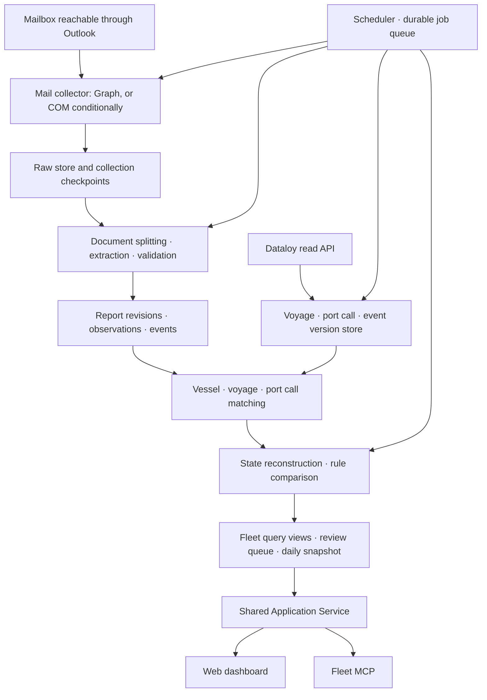

# Fleet Operations Dashboard — Architecture v2

Written 2026-09-14. Status: proposed design for implementation, before environment verification.
Baseline: the README and `docs/00`–`09` at VMwareconnect commit `49f760dde3326067fe2cde5ca8f6c5f7ccf868c2`.
Detailed review: [REVIEW-CLAUDE-DESIGN.md](REVIEW-CLAUDE-DESIGN.md).

## 1. Product definition

This is designed as **an operations review system that builds the fleet from Dataloy Operational voyages, continuously collects vessel reports from the Outlook mailbox reachable through VMware, and shows each vessel's latest reported position, working state, schedule and how it is reflected in Dataloy — always with the evidence attached.**

A user checks four things every day.

1. Which vessels and voyages am I responsible for today?
2. What is the last confirmed position and state, and as of when?
3. How are the vessel's ETA, port events and cargo progress reflected in Dataloy?
4. What do I need to check or correct, and on what evidence?

MCP is the natural-language interface to this data. Daily collection, evaluation and dashboard refresh must run whether or not a conversation is happening. v1 covers reading Dataloy and recording internal review actions. Writing to external systems, sending mail, AIS and laytime settlement are out of scope.

### Facts and unverified assumptions

The GitHub design and the public product documentation have been reviewed, and a running VMware Horizon desktop session with an Outlook window on screen has since been confirmed. The exact Outlook variant, whether the mailbox is Exchange Online or on-premises, VM persistence, the network path available for collection, mail API permissions, the Dataloy schema and the fleet size are all still unverified. The technology choices, intervals, tolerances and performance figures below are **initial proposals** and are to be fixed after measurement.

"Outlook inside VMware" names the access environment. It is not treated as proof that the mail only exists inside the VM. Even where Graph turns out to be available, it still has to be an approved access path for that specific mailbox.

## 2. Target structure



The system is not split into many microservices from day one. The default is **a modular Python backend, a worker, a web UI, and — where required — a collector process inside the VM**. Credentials and access boundaries are constrained per process and per account. The number of MCP servers need not equal the number of business modules.

### Deployment profiles

Decided by the user on 2026-09-14: the site, API and worker are deployed to **DigitalOcean App Platform**. The concrete components and the VM connection contract follow [the DigitalOcean deployment design](DEPLOYMENT-DIGITALOCEAN.md). Codex owns the design and the cloud side; if VMware access is unavailable to Codex, Claude takes on the internal collection verification. Claude's prior successful access is a user-confirmed fact, and Codex's screen access has since been confirmed as well. Whether unattended collection is possible has not been verified.

Follow-up confirmation: Codex selected and activated a running Horizon desktop session and read the Outlook screen. The collection method below is not settled by screen access alone — API/COM and unattended execution still require verification.

| Condition | Deployment |
|---|---|
| Approved Graph access and Dataloy are both reachable from App Platform | Collection and comparison run in an App Platform worker; the service serves UI, API and MCP. Where raw content may be stored is a separate policy question. |
| Outlook COM or in-VM access is required | Collector in the VM user session → authenticated HTTPS batch upload → App Platform service/worker. Raw content stays in the VM. |
| Upload from the VM to App Platform is not possible | Batches are brought in over an approved transfer path and processed. Until an automated path exists, real-time automatic refresh is not met. |
| Neither API nor COM is possible | Parser and comparison functions are verified against approved EML/MSG/file exports. The App Platform decision stands, and continuous automatic collection is stated as not met. |

The Graph path is chosen only after the Exchange deployment, application permissions and network path are verified. COM requires verifying the Classic Outlook installation, profile, user session, security prompts, cache scope and VDI reconnection. Collection can stop on logoff or on a non-persistent VM reset, so that is exposed as an availability metric. COM is not deployed as a non-interactive Windows Service. [Microsoft Outlook API selection](https://learn.microsoft.com/en-us/office/client-developer/outlook/selecting-an-api-or-technology-for-developing-solutions-for-outlook)

## 3. What the data means, and which source wins

Every value carries `source`, `semantic_kind`, `valid_time`, `observed_at`, `evidence` and `quality`. Multiple sources are never collapsed into a single "answer" column.

| Information | Default handling |
|---|---|
| Managed vessels, voyages, port call plans | From the validated Dataloy voyage and vessel master |
| Vessel-reported position | Latest position by validated observation time, labelled "last reported position" |
| Port and cargo progress | Chronological reconstruction from approved events. Conflicts between sources are shown side by side |
| ETA | Dataloy forecast and vessel-declared ETA for the same port call, shown in parallel |
| Recorded actuals | Only fields whose Dataloy event semantics and confirmation state have been verified |
| Vessel reports held in Dataloy | Collected as an additional source. Where the lineage is the same as the email, not counted twice as independent evidence |

There are two kinds of comparison. A **forecast difference** is the gap between the vessel ETA and the Dataloy ETA. A **recording difference** is the gap between an actual event the vessel reported and the actual recorded in Dataloy. The former is not presented as an input error.

## 4. Collection pipeline

### 4.1 Execution and recovery

Initial proposal: mail every 10 minutes, Dataloy every 30 minutes, a consistency sweep daily, and the daily brief at a time in the user's working timezone. Real intervals are matched to call limits and VM availability.

Jobs are stored as `queued → running → succeeded / retry_wait / failed`. Claims are atomic and re-runnable after lease expiry. Concurrency is limited per source, and duplicate requests are coalesced by `job_type + scope + requested_window`. Delivery is assumed to be at-least-once, so storage and derived computation are idempotent.

Each collection run records the requested range, page count, success/failure counts, `last_success_at`, `coverage_start/end`, completeness, cursor and failure reason. Timeouts and 429s use Retry-After with bounded backoff plus jitter. Authentication failures are routed to an operations queue rather than retried into a storm.

Collection complete and parsing complete are separate metrics. If parsing fails after the raw content is stored, the raw collection cursor may advance but `parsing_complete_through` does not. A "not reported" finding checks both states.

### 4.2 Outlook

- Configure the managed mailbox/store and folders. Searching for OPR vessel names is a secondary aid; first secure coverage of the configured report folders. Forwarded mail without the vessel name in the subject is classified too.
- Graph: a cursor per `(connector_id, mailbox_id, folder_id, query_version)`. Page through nextLink, and bind the durable write of the data and the cursor update in one transaction. Promote the deltaLink only for completed rounds. Delta does not support general `$search`, so the search API and the sync API are kept separate. [Graph delta](https://learn.microsoft.com/en-us/graph/delta-query-messages)
- Use Graph IDs consistently in ImmutableId mode, and handle exceptions such as archive moves. A move within the same mailbox is not counted as a new report. [Graph ID scope](https://learn.microsoft.com/en-us/graph/outlook-immutable-id)
- COM: store the StoreID/EntryID locator, the Internet Message-ID, and body/attachment hashes. Account for edits, folder moves and late cache sync as well as receive time, by re-querying overlapping windows and periodically re-scanning folders. Where the cache does not cover the whole mailbox, report coverage as limited.
- Cursor invalidation, new folders and failure recovery are handled by a re-collection with an explicit scope. Coverage is promoted back to normal only after duplicate suppression and a gap check.
- Deletion of the source mail is not automatically read as "report withdrawn". Changes in source accessibility are kept separate from business corrections and cancellations, under a retention policy.

### 4.3 Dataloy

The OPR set is the display set. The **sync set is widened to OPR + recently completed voyages + the next scheduled voyages + voyages related to unresolved review items**. The initial proposal is the previous 30 days and the next 14, adjusted by the observed report-delay distribution. A voyage that disappears from OPR is not deleted immediately; it keeps an individual re-query path and a status history.

Build a capability contract per resource: API version, authentication mode, status codes, vessel/voyage/port call key paths, plan versus actual semantics, timezone semantics, pagination, field selection, modification time, deletion/inactive markers and call limits. Refer to the operators in the public documentation such as GT/GTE, but test against the real tenant, including whether child event changes propagate. [Dataloy Filtering](https://api.dataloy.com/dataloy-rest-api/filtering)

Do not hardcode the name `VesselReport`. The official guide refers to `PositionReport`, so start by confirming the read resources and permissions on the current tenant. [Dataloy Vessel Report](https://api.dataloy.com/user-guides/vessel-report)

Raw responses are stored per page, versioned. A complete snapshot for a scope is promoted only after every page and any required sub-resource has been validated. Where several API calls cannot guarantee an atomic snapshot, record the query time range and the change version and re-query the items that moved. Partial results may be displayed but are never used for a "missing" finding.

## 5. Normalised model

One email can contain several reports, vessels, attachments and SOF events. One report can also be repeated in both the body and an attachment.

| Entity | Key fields and constraints |
|---|---|
| source_item | internal UUID, connector/mailbox/provider locator, internet_message_id (non-unique), receive time, accessibility |
| source_version | FK to source_item, content/attachment hashes, fetched_at, raw storage reference. Content version is immutable |
| document | FK to source_version, MIME part/attachment/body span, file format, extraction tool version |
| report_revision | logical report_id, revision, document_refs, report type, reporting period, supersedes, correction reason |
| observation | FK to report_revision, field_path, raw_value, typed_value, unit, valid_time, evidence_locator, validation_state |
| operational_event | event_id, event_type, vessel/voyage/port_call candidates, event_time, occurrence_key, cargo_operation_id, evidence_refs |
| vessel / vessel_alias | IMO/internal ID; alias validity period, source and review history. A name is never a global unique key |
| voyage / port_call | tenant + source_key; sequence number is a mutable attribute. A repeat call at the same port is still a separate port_call |
| dataloy_record_version | resource + key + content_hash, raw_ref, observed_at, source_modified_at, semantics_version |
| match_decision | subject, candidate list, matched/ambiguous/unmatched, rationale, algorithm version, approver, supersedes |
| sync_run / sync_cursor | runs and cursors, coverage and completeness, per source and scope |
| issue / issue_evaluation | stable issue key; per-evaluation evidence, rule version and result; assignee; lifecycle |
| review_action / audit_event | actor, action, before/after ref, reason, timestamp, optimistic version |
| fleet_snapshot / daily_brief | as_of, known_at, source watermarks, source revisions, projection/rule version |

### Time structure of an observation

```text
time.raw_text
time.local_value
time.utc_value: nullable
time.offset_minutes: nullable
time.zone_id: nullable
time.basis: EXPLICIT_OFFSET | VERIFIED_PORT_ZONE | VERIFIED_TEMPLATE | UNKNOWN
time.precision: MINUTE | HOUR | DATE
time.uncertainty_seconds: nullable
valid_time = the real instant or period the value describes
observed_at = the instant the system learned that value
```

The noon observation time, the ETA and every SOF event each carry their own time basis. Ship's time is never settled from longitude alone. The sign convention of Zone Description is verified against the actual form. A date-only event and a minute-precision event are not judged to match precisely. Midnight, DST, the date line and ship's-time changes are all tested.

### Corrections and duplicates

A copy of the original, a forward of the same report, and a re-quote of the same event are each distinguished. A byte-identical copy adds an evidence link but does not create a duplicate event. A correction is stored as a new revision without destroying the previous content. Where the new revision's evidence is insufficient, the existing approved value stands until reviewed.

The parse cache key is `(content_hash, parser_version, schema_version, template_version, model/prompt_version)`. A parser update runs as a reprocessing job and rebuilds only the affected vessel and voyage projections. `as_of` is the event time; `known_at` is what was known at that time. A historical report received today must not silently rewrite a brief issued yesterday.

## 6. Report extraction and validation

1. Split MIME parts, body, forwarded sections and attachments. Preserve the raw content while distinguishing a quoted older report from a new one.
2. Extract text and tables per file. The priority between body text, XLSX, PDF text and OCR of scans is decided by the real sample mix. An unsupported format counts as "awaiting interpretation", never "no report".
3. Process in order: template → generic label parser → LLM structuring where policy permits → human review.
4. Attach a source locator to each important field (body character range, Excel sheet/cell, PDF page/bbox) together with its validation result.
5. Only fields that pass validity, unit, time, vessel-consistency and compatibility-with-prior-events checks enter the projection.

The LLM handles value extraction and evidence-backed summarisation. It does not take execution instructions from mail content. The extraction worker is given no mail-sending, shell or Dataloy-write tools. Using an external model means the raw content leaves the machine, so "it runs in the VM" is never by itself a claim that the raw content stays in the VM. Where that is not permitted, use a local parser/model or manual review.

A single `parse_confidence` is not used as a probability of truth. `accepted / needs_review / rejected / missing` is tracked per field, and a report whose important values lack evidence is not auto-confirmed. A figure such as a template default of 0.95 is not a quality guarantee.

Coordinates are validated for sign, degree and minute ranges, latitude/longitude order, the validity of a zero value, the implied speed between observation times, and future timestamps. Physically impossible movement is quarantined, while preserving the possibility that the earlier report was the wrong one. A value mis-parsed into a plausible sea position cannot be caught by physical checks alone, so sampled accuracy evaluation is required.

Working reports separate `cargo_operation_id`, cargo/parcel, load versus discharge, period quantity, cumulative quantity, planned total, unit, ETC, and stoppage/resumption events. Cumulative quantities are never summed day over day. Completion percentage is computed only where a validated cumulative and total for the same operation exist, and the denominator and plan version are shown with it.

## 7. Vessel, voyage and port call matching

**Vessel:** a valid IMO matching the master → a reviewed alias plus a corroborating clue → name/sender/body candidates. A conflict between the IMO and the subject vessel name is quarantined. Even an exact name match is checked against same-name vessels, renamings and validity periods. A fuzzy score alone never auto-confirms.

**Voyage:** a vessel match is a precondition. An explicit voyage number is checked together with that number's period and any reuse for the vessel. The report event_time, voyage period, load/discharge ports and the leg are considered together. "There is only one OPR voyage" is a secondary clue. A delayed report must be able to attach to the previous voyage.

**Port call:** port_call source key → validated port/terminal alias, UN/LOCODE, time window and sequence context → geographic candidates. Where a repeat call at the same port or a neighbouring port exists, proximity alone does not decide. The source key relationship survives a sequence edit.

Each stage returns matched, ambiguous or unmatched. The review queue shows the candidates with their rationale. A manual decision carries a scope and a validity period. New conflicting evidence triggers re-review; a past alias is not blindly reused globally.

A report matched only to a vessel can still be used for position and report listings. The unresolved voyage state is stated explicitly and voyage-scoped rules are held. Reports from outside the fleet go to a separate candidate queue and are never auto-admitted into the managed fleet.

## 8. State and position reconstruction

Not every meaning is forced into a single enum.

| Axis | Examples |
|---|---|
| navigation_state | AT_SEA, AT_ANCHOR, ALONGSIDE, UNKNOWN |
| cargo_state | LADEN, BALLAST, PART_LOADED, UNKNOWN |
| activity_state | LOADING, DISCHARGING, BUNKERING, IDLE, SUSPENDED, UNKNOWN |
| data_state | CURRENT_REPORT, STALE_REPORT, UNVERIFIED, SOURCE_UNAVAILABLE |

State is replayed from accepted events in observed event_time order. A cargo report received late, after departure, does not rewind the current state. Future scheduled events are not used for current-state transitions. Stoppage and resumption, same-timestamp conflicts, corrections and cancellations, and multiple cargo operations are all handled. A state with no new evidence keeps its last-confirmed time and freshness.

Low speed alone does not establish drifting, being at anchor does not establish waiting for a berth, and a call at a load port does not establish laden. Departure and COSP, arrival and EOSP, NOR tendered and NOR accepted are separate events. The real tenant's event semantics dictionary is confirmed with the operations staff.

The map shows the latest validated **observed position**. Position, state, ROB and ETA can each have a different latest time, so they are never merged into a single "last updated". A port centroid is marked as a port-based display and is never presented as the vessel's GPS position. A missing recent report never fills the coordinate with (0,0).

Without AIS, v1 does not describe itself as providing real-time positions. A dashed line between observations connects report points and is not the actual route. Lines are split at the date line. Estimated positions and great-circle ETAs are off by default. If a computed ETA is added later, the approved distance, speed and route model plus its uncertainty are displayed separately, and it is excluded from actual-versus-plan comparison inputs.

## 9. Comparison engine and review flow

Before a rule runs, check that both sides refer to the same vessel, voyage, port call, event semantics, unit and time basis. Check too that the relevant sources were collected freshly and completely.

```text
evaluation = MATCHED | DISCREPANCY | PENDING_GRACE |
             INSUFFICIENT_DATA | NOT_COMPARABLE | SOURCE_UNAVAILABLE
```

Evaluation result and severity are separate. An empty value or a failed run is never converted into MATCHED.

| Rule | Evaluation condition | Initial policy |
|---|---|---|
| ETA difference | A comparable, latest forecast pair for the same intended port call | Review at 12h, propose priority review at 24h. Show the forecast time too; do not call it an error |
| Actual event not recorded | Confirmed vessel event + no corresponding Dataloy actual + a complete query | Consider the business grace period after receipt together with sync lag. Example: review after 12h |
| Event time difference | A pair of actual events with the same meaning + a confirmed timezone | Per-event tolerance. Initial example 60 minutes, CRITICAL disabled until business sign-off |
| Late report | Per-vessel/state reporting schedule + collection and classification healthy | Computed from the scheduled report time plus grace. A configured reporting cycle, not a fleet-wide fixed 30h |
| ROB difference | Same fuel grade, unit and event/allowed time window | Use the greater of an absolute tolerance and a 5% relative tolerance. A per-unit absolute value must be set by the operator |
| Port call order difference | Confirmed actual events against the plan version at that time | First distinguish plan changes, added calls and matching failures |
| Cargo progress difference | Same cargo operation, quantity basis, unit and period | Review period/cumulative confusion, totals exceeded, and completion reported but not recorded in Dataloy |
| Data quality | Errors in important fields, unmatched items, parsing backlog | A data review queue kept separate from operational discrepancies |

ROB values observed at different times are not compared directly. A consumption and bunkering correction model may be added as a secondary comparison only after separate validation. Summing fuel names also presupposes a validated grade mapping.

The issue identifier is based on `(tenant, rule_family, vessel, voyage, port_call, event_occurrence/field)`. A changing ETA value or the rule version itself does not enter the identifier; those go into the evaluation history. Occurrences are distinguished separately — for example, several NORs tendered at the same port.

The lifecycle is `OPEN → ACKNOWLEDGED → RESOLVED`, and ACKNOWLEDGED is still unresolved. A suppression carries a reason, an owner, a scope and an expiry. An issue is resolved when re-evaluation against real data clears it, and a recurrence is recorded. A material change in evidence triggers a review of the suppression policy. State changes use optimistic locking so concurrent edits do not overwrite each other.

Example: if the vessel's All Fast at 06:10Z has been received but Dataloy has not synced since 04:00Z, that is SOURCE_UNAVAILABLE, not "not entered in Dataloy". If only the 06:00Z arrival actual exists, that is a separate event from All Fast and does not settle it. A not-recorded review is raised only when the All Fast actual is still absent after a healthy sync and the grace period.

## 10. Dashboard

The first screen reads in the order "business day and as-of time → collection status → action list → vessel table and map". Implementation details such as internal parser versions appear only on the evidence and admin screens.

The top KPIs separate managed vessel count, report current/late/unconfirmed counts, open operational issue count and data review count. The denominator is the managed fleet per Dataloy OPR, shown with the as-of time of the last successful roster. During a Dataloy outage the last roster is kept but never presented as current.

Vessel table: name/IMO, voyage, last position observation time, navigation and activity state, current/next port, vessel ETA, Dataloy ETA, delta, report status, assignee and open issues. A vessel with no position stays in the table. Clicking the map selects the same vessel row and detail view.

The detail view is built around this comparison.

| Event / item | Vessel report | Dataloy plan / forecast | Dataloy recorded actual | Verdict / evidence |
|---|---|---|---|---|
| All Fast | 09-14 06:10Z | 09-14 05:00Z | None | In grace / not-recorded review |
| Next port ETA | 09-16 08:00Z | 09-15 18:00Z | Not applicable | Forecast +14h |

Every example is synthetic. "Not applicable", "No information", "Collection failed" and "Timezone needs confirmation" are shown with distinct wording. No alert is raised merely because an ETD still in the future has no actual against it.

The screens are: fleet overview, vessel detail (voyage timeline, reports, cargo work, ROB), review queue, daily brief, and connection status/admin. In the review queue the raw content and the extracted fields sit side by side, and the user can pick a voyage candidate, correct a field, acknowledge or hold.

Evidence retrieval is defined per deployment profile. Within the same security zone it opens directly through an authenticated evidence endpoint. Across a separated network it offers an approved minimal excerpt plus a source locator that opens inside the VM, and shows the state that direct external access to the raw content is unavailable. No unreachable "open original" link is created.

Times support the user's IANA timezone and label UTC, LT and offset explicitly. The daily cut-off is a setting and is not fixed to KST. List order is held while the user is reading, with a "new data available" prompt for refresh. When map tiles are unreachable, the vessel table and review work must continue to function.

## 11. API and MCP contract

HTTP and MCP share the Application Service, authorisation checks, audit and DTOs. MCP responses also carry the data as-of time and the evidence.

| HTTP example | MCP example | Responsibility |
|---|---|---|
| GET /api/v1/fleet | fleet_list_vessels | In-scope fleet summary, cursor paging |
| GET /api/v1/vessels/{id} | fleet_vessel_status | Per-field time, source and quality |
| GET /api/v1/voyages/{id}/timeline | fleet_timeline | Plan, recorded actual and vessel event comparison |
| GET /api/v1/positions | fleet_positions | GeoJSON, observed_at, position kind |
| GET /api/v1/issues | fleet_list_issues | Operational and quality queues, filters |
| GET /api/v1/evidence/{id} | fleet_get_evidence | Permission-checked raw content or minimal excerpt |
| GET /api/v1/briefs/{date} | fleet_daily_brief | Fixed as-of time and source watermarks |
| POST /api/v1/jobs | fleet_request_refresh | Register a permitted job, 202 + job_id |
| GET /api/v1/jobs/{id} | fleet_job_status | Progress, completion, partial failure |
| POST /api/v1/review-actions | fleet_review_issue | Internal record change, reason + expected_version |

Shared envelope: `data, as_of, known_at, source_watermarks, completeness, warnings, evidence_refs, next_cursor`.

Query tools are read-only. Refresh is described as a job-queue change and review as an internal business-record change. Arbitrary `path` imports, arbitrary URL requests and unbounded raw Dataloy exploration are excluded from the general MCP surface. Diagnostics for environment verification live in a separate admin CLI behind an allowlist. AI summaries in the brief reference evidence IDs and never convert an unverified state into an assertion. If AI generation fails, a deterministic template summary is returned.

## 12. Storage, security and operations

A personal PoC may use SQLite. The file stays on local disk; a live DB file is never shared or copied between VMs. The default proposal for multi-user operation is PostgreSQL, chosen for its transaction, job lease, permission and history-query requirements. Swapping the store is not assumed to be a simple driver change.

Given the deployment decision, the App Platform operational store is PostgreSQL. Container-local files on App Platform are not used as durable storage. The VM collector's local spool is separate, and on a non-persistent VDI its durable path must be verified.

Raw content and attachments live in encrypted files or object storage within an approved zone; normalised data and metadata live in the database. Raw retention, brief retention, deletion propagation and backup retention are fixed by organisational policy. Preserving a correction history and retaining raw content indefinitely are two different decisions.

Transfers across a separated network export allowlisted fields only. The manifest carries batch_id, producer_id, schema_version, sequence, previous batch reference, record_count, content_hash, coverage, creation time and authentication material. The receiver verifies hash and signature — or an authenticated channel — plus version and size, validates in staging, then applies atomically. ACK is issued only after a durable commit. Received batch_id and record revision prevent a resend from being processed twice. Conflicts, missing sequence numbers and unknown versions are quarantined. File transport uses tmp→ready rename; HTTPS transport uses an idempotency key.

A shared deployment requires a verified sign-in such as SSO/OIDC, Viewer/Operator/Admin roles, and fleet and raw-content access scopes. Source permissions are minimised per service identity. The same authorisation applies to the API, MCP, evidence retrieval and the brief. Raw content, tokens and personal data are never written to general logs or to Git. Mail HTML is sanitised and remote image loading is blocked. Attachments are handled without macro execution, under format, size and decompression limits.

Operational metrics: last successful collection, roster and folder coverage, raw-to-parse latency, unmatched rate, important-field review rate, sampled false positives and false negatives per rule, job retry count, VM heartbeat, evidence access failure rate. A single source outage is not displayed as a fleet-wide operational outage.

Disaster recovery: consistent backup of the database and the raw content references, incremental re-collection after restore, and a verified raw→projection replay. The initial target proposal is RPO 1h / RTO 4h, but feasibility depends on the retained mailbox and raw content accessibility. Independently of automatic sync retries, an operator must be able to choose a reprocessing scope.

## 13. Implementation order and exit criteria

| Stage | Deliverables | Exit criteria |
|---|---|---|
| 0 Environment and semantics | Accessibility table, Dataloy capability, event dictionary, 30–50 anonymised samples | One approved real collection path; API responses match a known voyage and time; representative report types captured |
| 1 Minimal vertical slice | 3–5 real vessels: automatic collection → position/ETA → comparison → evidence | Refreshes without a conversation. Restart after a stop produces no duplicate business events. Last reported position is traceable |
| 2 Time, corrections, matching | revision/observation, candidate review, multiple SOF events | Late, corrected, voyage-transition and repeat-call scenarios reproduced against golden data |
| 3 Business review | Issue lifecycle, plan/actual comparison, cargo reports | A collection failure is never misjudged as a missing report. ACK, expiry, resolution and recurrence are distinguished |
| 4 Team pilot | Authentication, dashboard, MCP, fixed brief | Real staff use it across consecutive business days, with error labelling and operational metrics captured |
| 5 Production cutover | Backup and restore, monitoring, operations runbook | Restore, token expiry and VDI restart drills completed; agreed quality targets met |

The Phase 0 sample is for validating the initial design. Operational quality evaluation proposes a separate held-out sample of at least 200 items, split across vessels, forms, report types and periods. The same form or a forwarded copy is not placed on both sides to inflate the score. Important fields (IMO, position, time, port call, event) report precision, recall and coverage individually. The initial targets are ≥99% precision on auto-confirmed important fields and ≥90% automatic structuring coverage on representative forms, but a score on a small sample is not a guarantee — the counts and the failure cases are published with it. Turning every rule off to reduce CRITICAL false positives is not accepted as passing; missed cases are evaluated too.

Required regression scenarios:

- Copies, forwards, folder moves and re-receipt of the same report produce no duplicate events.
- Multiple events in one SOF, and per-cargo-operation period and cumulative quantities, are preserved.
- A late historical noon, a new correction and an event cancellation are reflected correctly in both current state and past snapshots.
- Comparison is correctly held for unknown UTC, date-only values, DST, midnight and the date line.
- A single OPR voyage does not cause a report from the previous voyage to be auto-attributed.
- Repeat calls at the same port, neighbouring ports, voyage status changes and port sequence reordering are handled.
- A failed Dataloy page and an Outlook logoff do not generate missing-report or missing-event alerts.
- A crash after raw storage, a crash during cursor write, a lost transfer ACK and a re-run after worker lease expiry all produce no gaps and no duplicates.
- Vessels and raw content outside the caller's permissions are unreachable through HTTP, MCP and the brief alike.
- A database and raw-content restore, and a reprocess at a new parser version, explain any difference from the previous results.

## 14. Proposed directory layout and how the earlier docs are superseded

```text
src/vmwareconnect/
  domain/          # observations, events, identity, issues
  application/     # shared services and authorization
  connectors/      # outlook_graph, outlook_com, dataloy
  ingestion/       # cursors, coverage, raw versions
  extraction/      # document parsers and validators
  matching/        # candidates and decisions
  projections/     # state reducer and fleet snapshots
  reconciliation/  # rules and evaluations
  review/          # actions, suppression, audit
  jobs/            # scheduler, leases, retry, replay
  transport/       # optional boundary inbox/outbox
  api/             # HTTP routes
  mcp/             # fleet query/review adapter
  storage/         # repositories and migrations
web/               # UI source, locally bundled map assets
tests/             # anonymized fixtures, gold cases, integration
docs/contracts/    # verified tenant field/event mapping
```

For a small PoC the UI may stay as static HTML/JS. Once the review queue, field comparison and state management grow complex for team use, move to a TypeScript component UI. Settle the data contract and the review flow before the UI framework.

The earlier 00/01/02 are revised into the product definition, the deployment branch and the observation/revision model. 03 becomes continuous collection with per-field validation; 04 becomes capability and version snapshots; 05 becomes semantics-aware comparison with evaluation preconditions; 06 separates MCP from automatic execution; 07 becomes the plan/actual/report comparison; 08 becomes a vertical-slice roadmap; 09 becomes a decision record holding real verification results. This document is the current integrated design baseline. The earlier 00–09 documents are kept as draft history, and where they conflict, this document wins. Real environment verification results are recorded in [PHASE-0-DESIGN.md](PHASE-0-DESIGN.md).
