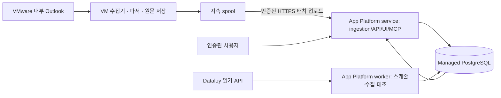

# DigitalOcean App Platform 배포 설계

결정일: 2026-09-14. 사용자 지정 호스팅: DigitalOcean App Platform.
상태: 설계 확정 방향 / 미구현·미배포. 리전·규모·계정·도메인·비용은 미확정.
관련 문서: [통합 설계](ARCHITECTURE-V2.ko.md), [Phase 0](PHASE-0-DESIGN.ko.md).

## 1. 역할과 실행 위치

Codex는 전체 설계, 공통 데이터 계약, Dataloy 읽기 연동, 대조 엔진, 웹/API/MCP, App Platform 배포 구성을 담당한다.
Codex가 VMware에 접근하지 못하면 Claude가 VM 내부 Outlook 접근 및 수집기 검증을 담당한다. Claude의 접속 성공 이력은 사용자가 확인했지만 자동 수집 방식과 무인 실행 가능성은 별도 검증 대상이다.

후속 확인: Codex도 VMware Horizon의 기존 데스크톱 세션을 활성화하고 Outlook 화면을 읽는 데 성공했다. 따라서 현재 Claude로 넘길 접근 차단은 확인되지 않았다. 신규 로그인·프로그램 기반 수집·재로그인 후 복구·전송 경로는 아직 검증하지 않았다.

기본 경로는 VM에서 데이터를 밀어 보내는 방식이다. 클라우드가 VMware 화면을 원격 조작하거나 VM에 직접 들어가는 구조는 요구하지 않는다. 승인된 Graph 접근이 클라우드에서 가능하면 수집기 위치를 바꿀 수 있지만 같은 정규화 계약을 유지한다.

## 2. App Platform 컴포넌트

| 컴포넌트 | 초기 구성 | 책임 |
|---|---|---|
| fleet-web service | Python API + 빌드된 웹 자산, 동일 origin | UI, 로그인, 데이터 조회, 내부 검토 액션, VM 배치 접수, HTTP MCP |
| fleet-worker worker | 웹과 같은 코드 기반의 별도 실행 명령 | Dataloy 주기 조회, 수신 배치 후처리, 매칭/대조, 브리핑 |
| Managed PostgreSQL | 운영 영속 DB, service/worker만 접근 | source version, job/lease, cursor, observations, issues, audit |
| 선택적 object storage | 예: 비공개 Spaces, 필요 시 추가 | 허용된 큰 정규화 배치·산출물. 원문 기본 전송 경로 아님 |

worker는 외부 URL로 접근할 수 없는 컴포넌트이므로 VM 업로드는 service에서 받는다. [DigitalOcean Workers](https://docs.digitalocean.com/products/app-platform/how-to/manage-workers/)

초기에는 DB에 지속 job 큐와 scheduler lease를 두고 worker가 실행한다. worker 인스턴스 수가 늘어나거나 재배포가 겹쳐도 같은 주기 작업이 중복 생성되지 않도록 schedule slot별 유일키를 사용한다. 특정 인스턴스 메모리에만 스케줄을 저장하지 않는다.

App Platform 로컬 파일은 영속 저장소가 아니다. SQLite, 커서, 배치 spool, 메일 원문을 컨테이너 디스크에만 저장하지 않는다. 일시 파일만 크기·수명 제한 아래 사용한다. [App Platform Limits](https://docs.digitalocean.com/products/app-platform/details/limits/)

## 3. VM → 클라우드 수신 계약

예정 API이며 현재 구현된 endpoint는 아니다.

`POST /api/v1/ingestion/batches`

- TLS와 collector별 회전 가능한 인증 토큰. collector에 허용된 mailbox/선대/scope를 서버에서 확인한다.
- Idempotency-Key는 collector_id + batch_id. 동일 키·동일 해시는 기존 접수 결과를 반환하고 동일 키·다른 해시는 409로 거절한다.
- payload는 schema_version, collector_id, batch_id, sequence, content_hash, coverage, record_count, report revisions, observations, source locator로 구성한다.
- 원문 본문·첨부·임의 remarks는 기본 제외한다. 원문 참조와 허용된 최소 발췌만 전송한다. 필드 allowlist로 enforcement한다.
- 초기 배치 한도 제안은 1 MiB/100 records이며 본문 크기와 레코드 수 둘 다 검사한다. HTTP 413은 쪼개 재전송한다. 한도는 실측 후 조정한다.
- API가 DB inbox와 후처리 job을 같은 트랜잭션으로 저장한 뒤 202 + receipt_id를 반환한다. 이 응답은 안전하게 접수했다는 뜻이며 파싱/대조 완료를 뜻하지 않는다.
- `GET /api/v1/ingestion/receipts/{id}`에서 accepted/processing/completed/quarantined를 조회한다. collector는 자신의 receipt만 읽는다.
- 수집기는 확실한 접수 확인까지 spool을 유지한다. timeout/응답 유실은 동일 batch_id로 재시도한다. ACK 후에도 격리 재처리가 가능하도록 정책에 따른 원본·전송 이력을 보존한다.
- token 만료, 네트워크 단절, sequence 누락, collector heartbeat 중단은 연결 문제로 표시하며 본선 미보고로 처리하지 않는다.

수집기가 의도적으로 과거 이벤트를 늦게 전송할 수 있으므로 인증 요청시각과 보고 event_time을 혼동하지 않는다. replay 방지는 batch 식별과 인증·해시로 수행하고 오래된 보고라는 이유만으로 버리지 않는다.

VM에서 HTTPS 업로드가 막히면 Claude가 승인된 전달 경로와 제약을 확인한다. 자동 우회 경로를 추측하지 않는다. 전달 경로가 없으면 클라우드 UI/대조는 가상 데이터로 개발할 수 있지만 자동 수집 완료로 보고하지 않는다.

## 4. Dataloy 비밀값과 연결 검증

사용자는 API 키를 제공할 수 있다고 확인했다. 키 값은 아직 받지 않았고 인증 방식도 확정되지 않았다. API 키, OAuth client credential, 기타 토큰을 같은 방식으로 가정하지 않는다.

| 설정 | 용도 | 보관 범위 |
|---|---|---|
| DATALOY_BASE_URL | 검증된 테넌트 API 주소 | worker runtime 설정 |
| DATALOY_AUTH_MODE | 확인된 인증 방식 | worker runtime 설정 |
| DATALOY_API_KEY | API 키 방식인 경우만 사용 | worker의 암호화된 runtime secret |
| DATALOY_CLIENT_ID / CLIENT_SECRET / TOKEN_URL / AUDIENCE | OAuth일 때만 사용 | worker 범위, secret 해당값 암호화 |
| DATABASE_URL | PostgreSQL 연결 | DB를 사용하는 컴포넌트 runtime binding |
| collector 인증 검증 자료 | ingestion 호출 인증 | server에는 검증에 필요한 값만, VM에는 해당 collector 키 |

실제 key header 이름이나 Bearer 사용 여부는 테넌트 계약으로 확인한다. 브라우저 번들, 빌드 변수, GitHub 파일에 키를 넣지 않는다. Dataloy 키는 collector/프론트엔드에 주지 않는다.

DigitalOcean에서는 암호화 환경변수와 RUN_TIME scope를 사용하고 컴포넌트별로 제한한다. 애플리케이션 로그에서도 인증 헤더와 토큰을 직접 가린다. [환경변수 관리](https://docs.digitalocean.com/products/app-platform/how-to/use-environment-variables/)

연결 검증은 읽기 전용으로 다음 순서로 수행한다: 인증 → 작은 페이지의 선박/항차 조회 → OPR 상태 확인 → 알려진 한 항차의 PortCall/EventLog 조회 → 시각 의미 대조 → 페이지네이션 및 변경 조회. 단계별 상태코드·응답 구조만 익명화해 기록한다. Dataloy가 source IP 제한을 사용하는지는 리전/네트워크 구성 확정 전에 확인한다.

## 5. 배포와 운영 기준

- GitHub 소스에서 빌드하는 service/worker를 구성한다. 현재 저장소에는 실행 코드가 없으므로 지금은 실행 불가능한 App Spec을 배포 가능 파일처럼 올리지 않는다.
- 개발 단계 자동 배포 대상과 운영 대상은 구분한다. 브랜치·리전·인스턴스 규모·도메인은 실제 앱 생성 시 확정한다.
- 빌드에는 DB 접근을 요구하지 않는다. DB migration은 배포 단계의 단일 실행 job으로 수행하고 schema lock을 둔다. 구버전 service/worker와 신버전이 잠시 공존해도 동작하도록 확장→전환→정리 순으로 변경한다.
- `/health/live`는 프로세스 상태, `/health/ready`는 serving에 필요한 DB/스키마 상태를 검사한다. Dataloy 또는 VM 장애는 별도 connector health로 표시하여 웹 전체를 내려버리지 않는다.
- 재배포 SIGTERM 시 새 job claim을 멈추고 진행 작업을 마무리하거나 lease 만료 후 재처리한다. inbox/job/업무 projection 변경은 중복 실행을 견딘다.
- 운영 DB는 Managed PostgreSQL로 구성하고 app을 필요한 trusted source로 지정한다. 실제 private network와 connection pool 구성은 선택 리전/상품 지원을 검증한다. [Database 관리](https://docs.digitalocean.com/products/app-platform/how-to/manage-databases/)
- App Platform URL이 공개 접근 가능하더라도 운항 데이터/API/MCP는 인증 후 접근한다. 원문 원격 접근이 안 되면 위치 참조와 조회 제한 상태를 표시한다.
- DB 복원, worker 재시작, ACK 유실, VM 재로그인, 키 회전, 부분 API 실패를 파일럿 통과 조건으로 둔다.

## 6. 아직 필요한 입력

VMware 접속 방식/주소, Outlook 종류, Dataloy Base URL/인증 계약, DigitalOcean 대상 계정 또는 기존 app, 리전·규모, 사용자 로그인 방식, 승인된 데이터 전송 범위.
비밀값 자체는 연결 검증에 필요한 시점에 runtime secret으로 설정한다. 현재 문서는 배포 방향을 반영한 설계이며 실제 App Platform 리소스 생성이나 사이트 배포를 수행했다는 의미가 아니다.
