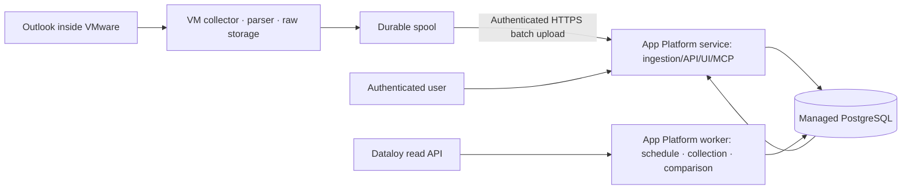

# DigitalOcean App Platform deployment design

Decided 2026-09-14. Hosting chosen by the user: DigitalOcean App Platform.
Status: settled direction / not implemented, not deployed. Region, size, account, domain and cost are undecided.
Related: [integrated design](ARCHITECTURE-V2.md), [Phase 0](PHASE-0-DESIGN.md).

## 1. Roles and execution locations

Codex owns the overall design, the shared data contracts, the Dataloy read integration, the comparison engine, web/API/MCP, and the App Platform deployment configuration.
If Codex cannot reach VMware, Claude takes on in-VM Outlook access and collector verification. The user confirmed Claude's prior successful access, but the collection method and whether unattended execution is possible are separate verification items.

Follow-up confirmation: Codex also activated an existing VMware Horizon desktop session and read the Outlook screen. No access blocker requiring handover to Claude has therefore been confirmed. A new sign-in, programmatic collection, recovery after re-login, and the delivery path remain unverified.

The default path is the VM pushing data out. No part of the design requires the cloud to drive the VMware screen remotely or to enter the VM directly. If approved Graph access turns out to be possible from the cloud, the collector location can move while the same normalisation contract is kept.

## 2. App Platform components

| Component | Initial configuration | Responsibility |
|---|---|---|
| fleet-web service | Python API plus built web assets, same origin | UI, sign-in, data queries, internal review actions, VM batch intake, HTTP MCP |
| fleet-worker worker | Same codebase as the web, different run command | Periodic Dataloy queries, post-processing of received batches, matching and comparison, briefs |
| Managed PostgreSQL | Durable operational database, reachable only by service and worker | Source versions, jobs/leases, cursors, observations, issues, audit |
| Optional object storage | For example a private Space, added if needed | Permitted large normalised batches and artefacts. Not the default path for raw content |

A worker is not reachable at an external URL, so VM uploads are received by the service. [DigitalOcean Workers](https://docs.digitalocean.com/products/app-platform/how-to/manage-workers/)

Initially the durable job queue and the scheduler lease live in the database and the worker executes them. A unique key per schedule slot prevents the same periodic job from being created twice when worker instances scale up or redeployments overlap. The schedule is never held only in one instance's memory.

App Platform local files are not durable storage. SQLite, cursors, batch spools and raw mail are never stored only on the container disk. Only transient files are used, under size and lifetime limits. [App Platform limits](https://docs.digitalocean.com/products/app-platform/details/limits/)

## 3. VM → cloud intake contract

This is a planned API, not an endpoint that exists today.

`POST /api/v1/ingestion/batches`

- TLS plus a rotatable per-collector authentication token. The server checks the mailbox/fleet/scope permitted to that collector.
- The Idempotency-Key is collector_id + batch_id. The same key with the same hash returns the existing intake result; the same key with a different hash is rejected with 409.
- The payload carries schema_version, collector_id, batch_id, sequence, content_hash, coverage, record_count, report revisions, observations and the source locator.
- Raw bodies, attachments and free-form remarks are excluded by default. Only source references and permitted minimal excerpts are sent, enforced by a field allowlist.
- The initial batch limit proposal is 1 MiB / 100 records, checking both payload size and record count. HTTP 413 means split and resend. Limits are adjusted after measurement.
- The API stores the DB inbox row and the post-processing job in one transaction, then returns 202 with a receipt_id. That response means safely received — not parsed and compared.
- `GET /api/v1/ingestion/receipts/{id}` reports accepted / processing / completed / quarantined. A collector reads only its own receipts.
- The collector keeps its spool until intake is definitely confirmed. A timeout or a lost response is retried with the same batch_id. After ACK, the source and transfer history are retained per policy so a quarantined batch can be reprocessed.
- Token expiry, network loss, a missing sequence number and a stopped collector heartbeat are shown as connection problems, never as a vessel failing to report.

Because a collector may deliberately send past events late, the authenticated request time is never confused with the reported event_time. Replay protection uses batch identity plus authentication and hashes; a report is not discarded merely for being old.

If HTTPS upload from the VM is blocked, Claude confirms the approved transfer path and its constraints. No workaround path is invented. Without a transfer path, the cloud UI and comparison can still be developed against synthetic data, but automatic collection is not reported as complete.

## 4. Dataloy secrets and connection verification

The user has confirmed an API key can be supplied. The key value has not been received and the authentication mode is not settled. An API key, an OAuth client credential and other tokens are not assumed to work the same way.

| Setting | Purpose | Storage scope |
|---|---|---|
| DATALOY_BASE_URL | Verified tenant API address | Worker runtime configuration |
| DATALOY_AUTH_MODE | Confirmed authentication mode | Worker runtime configuration |
| DATALOY_API_KEY | Used only if the mode is API key | Encrypted runtime secret on the worker |
| DATALOY_CLIENT_ID / CLIENT_SECRET / TOKEN_URL / AUDIENCE | Used only for OAuth | Worker scope, secret values encrypted |
| DATABASE_URL | PostgreSQL connection | Runtime binding on the components that use the database |
| Collector authentication verification material | Authenticating ingestion calls | Only the values needed for verification on the server; the matching collector key on the VM |

The actual key header name, and whether Bearer is used, are confirmed from the tenant contract. Keys never go into the browser bundle, build variables or GitHub files. The Dataloy key is never given to the collector or the frontend.

On DigitalOcean, use encrypted environment variables with RUN_TIME scope, restricted per component. Authentication headers and tokens are masked in application logs too. [Managing environment variables](https://docs.digitalocean.com/products/app-platform/how-to/use-environment-variables/)

Connection verification is read-only, in this order: authenticate → fetch a small page of vessels/voyages → check OPR status → fetch the PortCall/EventLog of one known voyage → compare the time semantics → test pagination and change queries. Only the status codes and response shapes are recorded, anonymised, per step. Whether Dataloy enforces source IP restrictions is checked before the region and network configuration are settled.

## 5. Deployment and operating criteria

- Configure a service and a worker built from GitHub source. The repository currently has no backend code, so an App Spec that cannot actually run is not published as if it were deployable.
- Keep the automatic-deploy development target and the production target separate. Branch, region, instance size and domain are settled when the real app is created.
- The build does not require database access. Database migrations run as a single job in the deploy step, behind a schema lock. Changes follow expand → switch → clean up so old and new service/worker versions can coexist briefly.
- `/health/live` checks process state; `/health/ready` checks the database and schema state needed to serve. A Dataloy or VM outage is reported as connector health so it does not take the whole site down.
- On SIGTERM during redeployment, stop claiming new jobs and either finish in-flight work or let the lease expire and be reprocessed. Inbox, job and business projection changes tolerate duplicate execution.
- The production database is Managed PostgreSQL with the app added as a trusted source. Actual private networking and connection pool configuration depend on the chosen region and product support. [Managing databases](https://docs.digitalocean.com/products/app-platform/how-to/manage-databases/)
- Even though the App Platform URL is publicly reachable, operational data, the API and MCP require authentication. Where remote access to raw content is unavailable, the position reference and the restricted-retrieval state are displayed.
- Database restore, worker restart, a lost ACK, VM re-login, key rotation and partial API failure are pilot exit criteria.

## 6. Inputs still required

The VMware access method and address, the Outlook variant, the Dataloy base URL and authentication contract, the target DigitalOcean account or existing app, region and size, the user sign-in method, and the approved data transfer scope.
Secrets themselves are set as runtime secrets at the point connection verification needs them. This document reflects the deployment direction; it does not mean App Platform resources have been created or a site has been deployed.
